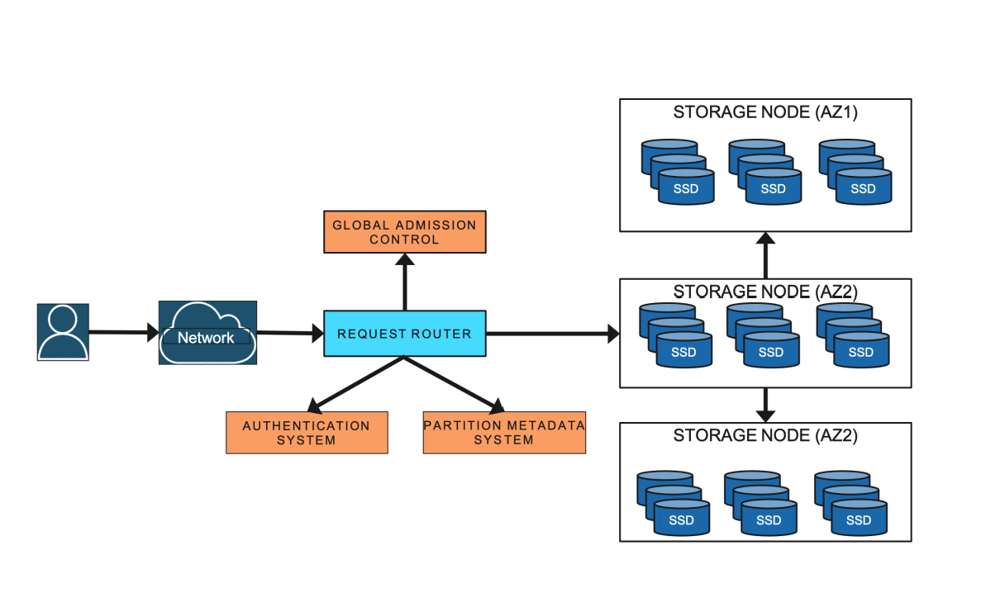

# DynamoDB 论文阅读笔记

## 简介

DynamoDB 是一款 AWS 托管的 key value 数据库, 有低延迟, 高可用, 多租户, 易扩容等特性

## 表结构

一张 table 由 item 的集合组成, 每个 item 都可以有自己的 attritubes, 每个 item 有一个 primary key

一张表除了 primary key, 也可以通过 secondary key 来做查询

## API

API 比较简单, 下面四个对应创建, 更新, 删除, 获取

PutItem

UpdateItem

DeleteItem

GetItem

## 分片

DynamoDB 根据 key 来做分片, 每个分片对会有多个副本, 作为一个分片集群, 每个分片集群有一个 leader, 只有 leader 可以处理写请求以及要求强一致性的读请求 (我理解对于不需要强一致性的读请求可以由 follower 节点处理, 强一致性读请求需要走 leader 节点)

每个分片集群会采用类似 raft 的共识算法来做 leader 选举, 也会通过 log replication 来同步 write ahead log 来达成最终一致性

一个节点会可能包含多组不同的分片

## 架构

除了用于存储的分片集群, 会有一个路由服务 (routing service) 来做 meta 信息存储, 根据 meta 信息做路由, 身份认证以及, 限流

autoadmin 服务负责所有控制平面相关的操作, 例如: 监控分片的健康状况, 替换不健康的分片节点, 分片扩容

## 限流和隔离

### Global admission control

最初的方案是以分片为单位在做限流, 请求放到到分片对应的的 router, router 对应的令牌桶减去一个 token

这么实现的问题是当有热点分片的时候会有 throttling

Global admission control(GAC) 机制用于解决这个问题, 分片 router 对应的本地令牌桶保留, 另外会有全局的令牌桶, 每个全局的对应多个本地令牌桶

本地令牌桶维护一定数量的 token, token 耗尽后会从全局的令牌桶补充

全局的令牌桶会根据当前节点的负载以及 client 的用量来决定 token 的补充

通过多加一层全局令牌桶实现了隔离性和资源利用率的平衡

### Partition split

即使有了 GAC, 还会有部分热点分片会遇到 throttling, 这时候可以尝试把热点分片做一下 split

## 故障恢复和效验

### 备份和恢复

故障恢复主要依赖于快照和 write ahead log

DynamoDB 会间隙地生成快照并上传到 S3

write ahead log 会在多个分片间同步, 同时也会间歇性地上传到 S3

当有节点需要恢复则会通过快照加 write ahead log 来做

可以实现过去某一个时间点的准确复原

### 正确性效验

每一个 log entry, 消息交换都会做 checksum 验证, 同时日志会上传到 S3 做备份, 备份前后也会做 checksum

## 高可用

### 可用性保障措施

1. 分片集群内的节点分散在不同的可用区
2. 通过混沌测试做故障演练
3. 对于外部系统(例如: AWS Identity, AWS key management service)的调用做缓存, 当外部系统不可用时, 通过使用缓存保证不影响 DynamoDB 的可用性
4. 对于 meta 信息, DynamoDB 做了一个叫 MemDS 的分布式 in-memory store, 路由器在 cache hit 之后通过异步请求从 MemDS 来刷新分片信息, 以此保证 MemDS 的流量是稳定的, 不会有 peak; MemDS 的更新是当 storage partion 变动之后向 MemDS 推送更新请求, storage partion 是 source truth

### 读写可用性

1. leader 处理写操作, 会有 quorum 机制, 多数节点确认有写才有效
2. 假如有 2f + 1 个节点, 能允许 f 个节点失联
3. 当有节点失联, 为了保证 quorm 机制有效, leader 增加一个 log replica 来记录日志, 算是一种降级措施
4. 读操作提供最终一致性

### 故障检测

1. leader 和 follower 之间通过 heartbeat 来检测
2. 当 follow 检测不到 leader, 这时候会询问其他 follower 是否能检测到 leader, 通过这一次询问来避免一些 false-positive 的场景, 避免无谓的重复选举

### 事务

DynamoDB 支持分布式事务, 底层通过二阶段提交来实现, 同时不影响非事务操作

当事务操作和非事务操作修改同一个 item 时候, 两者之间的隔离性存疑, 论文里没说

## 参考

- [Amazon DynamoDB: A Scalable, Predictably
Performant, and Fully Managed NoSQL
Database Service](https://pdos.csail.mit.edu/6.824/papers/atc22-dynamodb.pdf)
- [6.5840 DynamoDB lecture PPT](https://pdos.csail.mit.edu/6.824/notes/DynamoDB-MIT-Lecture-2023.pdf)
