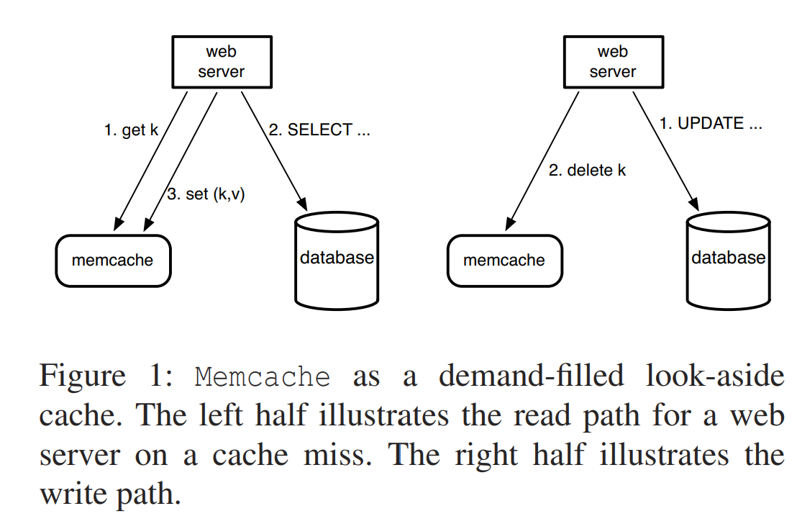
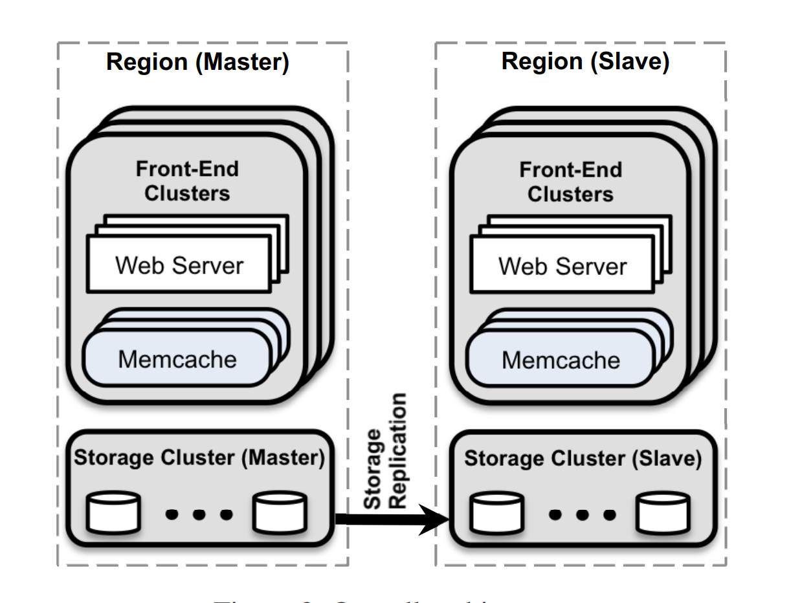
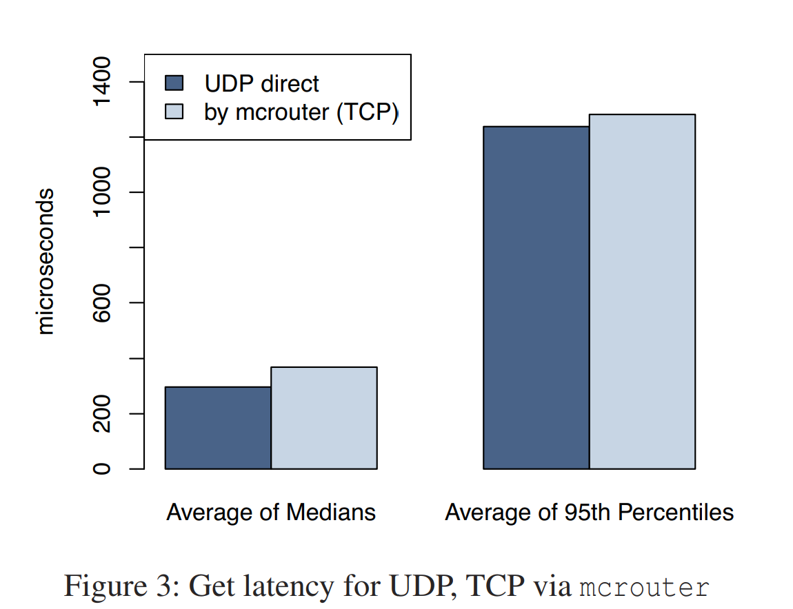
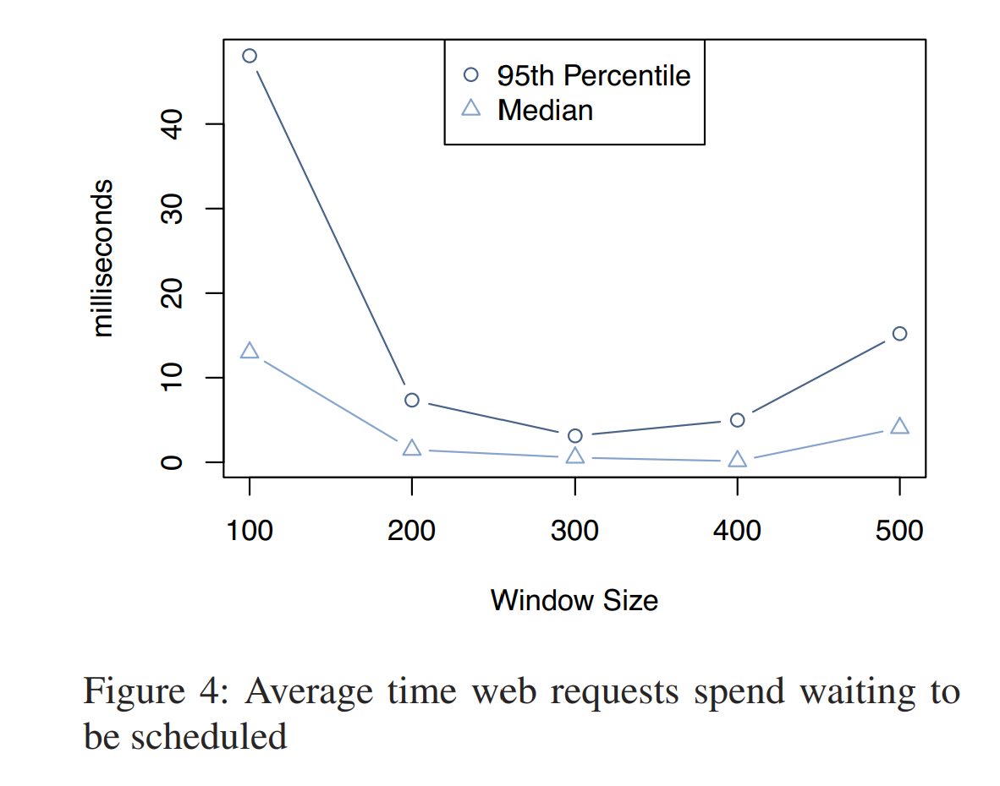

# Scaling Memcache at Facebook 阅读笔记

## 简介

论文讲述了 facebook 基于开源的单机 memcache 改造, 打造一个分布式低延迟高吞吐高可用缓存集群

### Overview architecture

更新策略: cache aside

总体架构如下:

## 低延迟

低延迟相关的优化基本在 client 端

### Batch request

尽可能批量/并行发送请求, 减少 round trip, 增加 concurrency

### Client server 交互

Get 请求用 udp, 而不是 tcp, 以此降低延迟, 会有 0.25% 的请求由于丢包(80%), out of order(20%) 等问题出错, 碰到这种情况 client 直接当 cache miss, 算是一种为了低延迟的 tradeoff, 毕竟 memcached 主要作为 cache, 可允许一定程度的不可用性

Set, Delete 请求依然用 tcp, 通过 mcrouter 降低 tcp 链接的数量, 以此节省 cpu, mem, 带宽等资源

注: mcrouter 是一个 client-side proxy, 可以作为 lib 在 client 进程中调用, 也可以作为一个独立的前向代理进程

下图是 tcp 和 udp 在延迟方面的对比, udp 的延迟大概比 tcp 低 20%

### 限流

Client 端会用滑窗限流, 这里让我有点想不明白的是居然不是在 server 端来做集中限流

Client 端限流没有 server 的负载情况很难全局性做出最佳限流策略

下图是窗口大小对延迟的影响, 窗口约小, 平均延迟越大, 窗口库越大, server 负载越大

## 低负载

### lease

lease 解决的场景:

1. stale sets: 并发场景 set 请求顺序乱序, 造成 cache 不反应最新的值
2. thundering herds: 并发读和写的场景, 通过 cache-aside 方式的写请求 invalidate cache 值, 造成大量读请求穿透

对于问题 1, lease 起到了 mutex 的作用, 让一段时间内只允许固定 client 的 set 请求

对于问题 2, lease 在固定时间内某个 key 只发一个 token, 没要到 token 的 client 过一段时间重试, 重试时候 read 请求大概率能读到值, 不至于 cache miss 去读 db

### Memcache Pools

对于不同类型的 key 放到不同的池, 例如对于不经常访问, 但是一旦 cache miss 成本高的 key 放到一个小池子
对于经常访问, 但是 cache miss 成本低的 key 放到一个大池子, 通过这种分池的手段减少 cache miss

### Replication within pool

通过对一个 pool 做副本, 来分流单个节点的压力, 增加吞吐量

## 容错

维护小部分 gutter 机器, 当有 outstage 爆发时候, client 当尝试请求失败, 会把请求发到 gutter 机器, 这时候 cache miss 后
把值更新到 gutter 机器

这种方式区别于把 key rehash 到没受故障影响的机器, 那种方式可能因为 hot key 影响到其他机器, 造成级联故障

## 参考

[Scaling Memcache at Facebook](https://pdos.csail.mit.edu/6.824/papers/memcache-fb.pdf)
