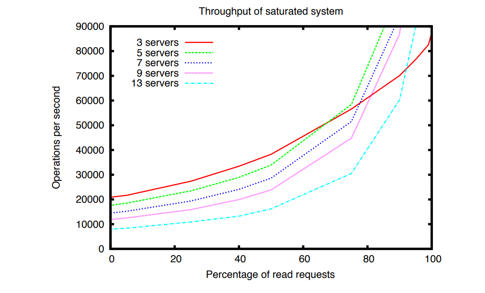

# Zookeeper 论文阅读笔记

## 简介

Zookeeper 是一个分布式协调系统, 特点有:

1. 请求 wait-free
2. 高性能, 高可用
3. 对于每个 client 来说, 请求是 FIFO 且写请求是 linearizability

## 存储模型


Zookeeper 存储模型是一个树形结构库, 每个树的节点是个 znode

有 Regular, Ephemeral 两种方式使用 api

Regular: client 通过 api 显示地创建删除 znode

Ephemeral: client 通过 api 创建 znode, 当 client session 结束后, znode 会自动被删除

## API

1. create(path, data, flags)
flags 代表是 regular 还是 ephemeral 类型
2. delete(path, version)
如果路径是 version 对应的版本, 则删除(可以用来实现乐观锁)
3. exists(path, watch)
Watch 路径, 有变动则 callback
4. getData(path, watch)
获取 path 的存储值, 并 watch 路径变动
5. sync(path)
Client 的读请求可能发到 follower 节点, follower 节点的值可能不是最新的, sync 请求相当于要求把最新的值更新到请求对应的 follower 节点
6. getChildren(path, watch)
或者子节点以及监控子节点变化

所有的 api 都有同步和异步两种, 同步的调用阻塞等待结果

异步的调用支持并发请求, Zookeeper 会保证返回的结果是顺序的(这里的顺序是从 zookeeper 的视角来看的, zookeeper 先收到哪个, 哪个就先返回, 从 client 的视角没法保证顺序), 这个保证称为 A-linearizability, 区别于 linearizability 一个 client 只能有一个 outstanding request, A-linearizability 支持并发

## 使用场景

1. 配置中心: client 通过 watch 监控路径, 有变动则获取配置变动
2. 组群管理: 通过指定路径表示组, client 添加成员则向指定组下创建子节点, client 通过监控路径监控组变化, client session 断了之后节点自动删除
3. 分布式锁: 通过 SEQ 的方式创建 znode, 越先创建的 seq 值越小, 如果当前是最小的 seq, 则获取锁; 监控当前 seq - 1 的节点, 有变动则做一下判断是否是当前最小 seq, 通过只监控 seq - 1 避免 herd effect

```
Lock
1 n = create(l + “/lock-”, EPHEMERAL|SEQUENTIAL)
2 C = getChildren(l, false)
3 if n is lowest znode in C, exit
4 p = znode in C ordered just before n
5 if exists(p, true) wait for watch event
6 goto 2

Unlock
1 delete(n)
```

4. 分布式读写锁: 写锁和上一段一样的逻辑, 读锁的区别是只监控上一个写 znode, 上一个写 znode 释放后, 判断比当前 seq 小的节点里有没有 write znode, 没有就 hold 锁
```
Write Lock
1 n = create(l + “/write-”, EPHEMERAL|SEQUENTIAL)
2 C = getChildren(l, false)
3 if n is lowest znode in C, exit
4 p = znode in C ordered just before n
5 if exists(p, true) wait for event
6 goto 2
Read Lock
1 n = create(l + “/read-”, EPHEMERAL|SEQUENTIAL)
2 C = getChildren(l, false)
3 if no write znodes lower than n in C, exit
4 p = write znode in C ordered just before n
5 if exists(p, true) wait for event
6 goto 3
```

## Zookeeper 内部实现


### Request router

根据 client 的请求推算更新后的状态, client 的写请求不一定是幂等的, leader 推算出更变后的状态(幂等的), 调用 setDataTXN 带上预期匹配的版本号

### Atomic broadcast

只有 leader 会处理写请求, leader 根据仲裁机制 (quorum) 决定是否成功写入, 类似于 raft 会有日志记录了请求

请求可能是并发的, 所以为了保证 FIFO 有序性, 可以通过维护和 follower 维护一个 tcp 请求, 通过 tcp 本身的有序机制发送请求

### Replicated Database

副本节点使用 inmemory db, 阶段性地对 znode 做 dfs 生成 fuzzy snapshot, 生成快照期间不会上锁, 所以可能会带上生成快照期间的改动, 因为请求是幂等的, 所以只要把生成快照时间节点后的请求重发一遍, 就不会有问题

### Pipeling

通过批处理请求提高系统吞吐量: Client 批量发送请求, Zookeeper 节点批量处理请求并返回

### Client/server 交互

只有 leader 处理写请求, 保证写请求的 linearizability

Zookeeper 为了高吞吐量, 读请求可以访问从节点, 没有选择把读请求也做成 linearizability, linearizability 要求所有读请求都访问 leader 节点

读请求可能读到过时的数据, 需要通过调用 sync 解决

FIFO 是通过 client 对请求标记 number(zid), session 来实现的

## 性能评估

### 吞吐量

#### 增加服务器对请求的影响




增加服务器可以缩短读请求的延迟以及增加吞吐量; 对写请求则相反

原因:

1. zab 广播会增加延迟
2. zab 日志持久化有 cost

#### leader-only 对吞吐量的影响 


如果所有读写请求都走 leader, 即便 server 增加, 吞吐量也没法很好地扩展

### 故障恢复


1, 2, 4 都是follower 的失败和恢复；
3,5 是 leader 的崩溃和恢复

可以看到 follower 的恢复是很快的, 对吞吐量的影响不大; leader 的恢复大概在 200ms, 也能比较快速地恢复

## 参考

- [ZooKeeper: Wait-free coordination for Internet-scale systems](https://pdos.csail.mit.edu/6.824/papers/zookeeper.pdf)